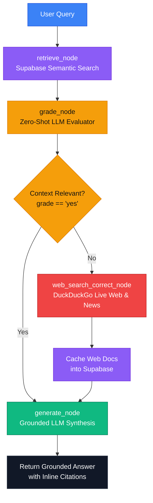

# factify

**[Click here to access the live website!](https://factify.sriyavemuri.com)**

---

## What the Project Does

* **Corrective RAG (CRAG) Agent Architecture**: Leverages a LangGraph state machine to evaluate vector database search relevance and automatically trigger web search fallbacks if context is insufficient.
* **Automated Document Retrieval**: Searches indexed embeddings stored in Supabase to extract the top relevant context snippets for any user question.
* **Zero-Shot Context Grading**: Evaluates retrieved database documents with an LLM evaluator to confirm data relevance before generating responses.
* **Live Web Search Fallback**: Automatically queries DuckDuckGo news and web indexes when vector database results fail relevance checks.
* **Automated Context Caching**: Stores real-time DuckDuckGo search results back into Supabase to optimize future similarity searches.
* **Grounded Answer Generation**: Synthesizes verified responses with explicit document source citations to prevent hallucinations.

---

## How It Works

* **Query & Retrieval**: User queries trigger semantic search queries against vector embeddings stored in Supabase.
* **Relevance Evaluation**: A zero-shot LLM node grades context relevance. If relevant (`yes`), the graph routes directly to answer generation.
* **Corrective Search Loop**: If context is irrelevant or missing (`no`), the agent triggers DuckDuckGo live web and news search APIs, caches newly found content to Supabase, and updates graph state.
* **Grounded Generation**: The final LLM node synthesizes a factual summary, citing source context documents explicitly.

---

## Architecture

### Architecture & Agent Workflow



---
## Tech Stack

* **AI Agent & Framework**: LangGraph, LangChain, OpenAI API (GPT-4o-mini)
* **Backend & Storage**: Python, FastAPI, Supabase (Vector Search), DuckDuckGo Search API (`ddgs`)
* **Frontend**: JavaScript, React.js, Tailwind CSS
* **DevOps & Tooling**: Docker, GitHub Actions (CI/CD pipelines), Git, Python Logging

---

## What I Learned

* **State Machine Agent Design**: Building stateful, multi-step agent workflows using LangGraph (`StateGraph`, conditional edges, and typed graph states).
* **Corrective RAG (CRAG) Patterns**: Implementing self-correcting retrieval pipelines that grade document relevance and dynamically route requests to live search fallbacks.
* **Vector Search & Real-Time Caching**: Integrating Supabase vector search with automatic caching mechanisms to index live search results back into a vector database for future queries.
* **Zero-Shot LLM Evaluation**: Designing strict guardrail prompts using `ChatOpenAI` and structured messages (`SystemMessage`, `HumanMessage`) to evaluate retrieval quality and prevent hallucinations.
* **Resilient API Handling**: Structuring graceful fallback loops and error handling around external APIs (like DuckDuckGo) to handle rate limits and 403 response errors without crashing the agent pipeline.

---

## Getting Started Locally

* **Step 1 (Clone Repository)**:
  * `git clone https://github.com/YOUR_USERNAME/factify.git`
  * `cd factify`

* **Step 2 (Environment Setup)**:
  * Create a `.env` file in the project root directory.
  * Add your OpenAI key and logging level:
    ```dotenv
    OPENAI_API_KEY="sk-your-openai-key-here"
    ENV_LOGGER="INFO"  # Set to DEBUG for detailed state machine execution logs
    ```

* **Step 3 (Backend & Dependencies Setup)**:
  * `cd backend`
  * `python -m venv .venv`
  * `source .venv/bin/activate` (or `.venv\Scripts\activate` on Windows)
  * `pip install -r requirements.txt`

* **Step 4 (Run Agent in Terminal)**:
  * Execute the LangGraph interactive CLI runner:
    ```bash
    python agent.py
    ```

* **Step 5 (Frontend Setup)**:
  * `cd ../frontend`
  * `npm install`
  * `npm start`

* **Step 6 (Docker Deployment Option)**:
  * `docker-compose up --build`
